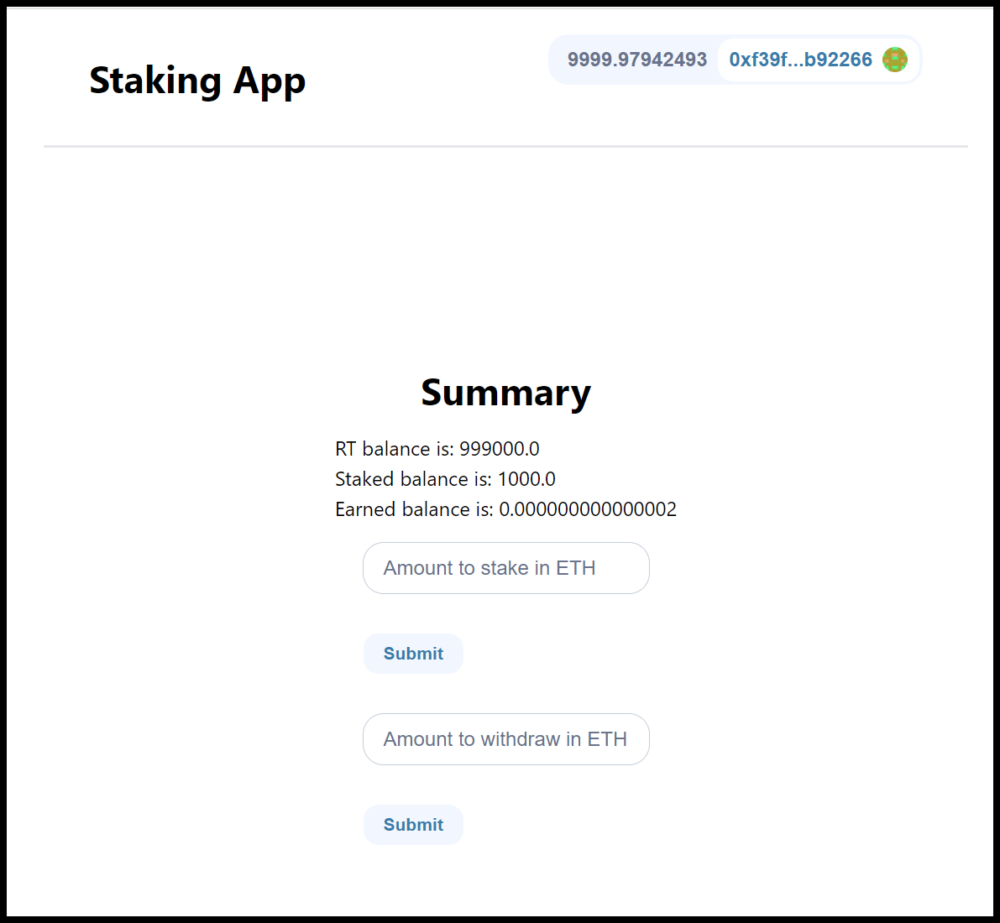

# ERC-20 Token Staking DApp

<br/>
<p align="center">

</p>
<br/>

## DApp Features

- Stake $RT tokens into contract
  - Once staked, these $RT tokens will automatically earn interest over time
- Withdraw $RT Tokens back into wallet with interest
- Connect to dapp using Moralis's Connect Wallet feature

NOTE: Tokens will automatically be created after launching `def-minimal` and added to generated hardhat wallet addresses

## Instructions to Run DApp

1. [Run a Local ETH Network](#1-run-a-local-eth-network)
2. [Import local test wallet into MetaMask](#2-Import-local-test-wallet-into-MetaMask)
3. [Run Frontend Dev Server](#2-Run-Frontend-Dev-Server)
4. [Use frontend and interact with dapp](#3-Use-frontend-and-interact-with-dapp)

### 1) Run a Local ETH Network

One of the best ways to test and interact with smart contracts is with a local network. Make sure you are running the correct version of node: `nvm use 16.13.2`.

Open a terminal window and navigate to the `defi-minimal` dir.

```bash
cd defi-minimal/
```

Then run a local network with all your contracts in it by:

```bash
yarn hardhat node
```

You'll get a local blockchain, private keys, contracts deployed (from the deploy folder scripts), and an endpoint to potentially add to an EVM wallet.

### 2) Import local test wallet into MetaMask

- how to import a hardhat generated wallet address into MetaMask for testing: https://youtu.be/5vhVInexaUI?t=1708
  - Add $RT token address to MetaMask to view tokens: `0xDc64a140Aa3E981100a9becA4E685f962f0cF6C9`

### 3) Run Frontend Dev Server

Open a second terminal window and navigate to `staking-app` dir.

```bash
cd staking-app/
```

Run the development server:

```bash
npm run dev
```

Open [http://localhost:3000](http://localhost:3000) with your browser to see the result.

### 3) Use frontend and interact with dapp

- Navigate to the dapp on the frontend and interact by testing out the `stake` and `withdraw` fields.

## Troubleshooting

#### Issue:

- Metamask throws a Nonce error when trying to interact with contract (staking, withdrawing) in the frontend.

#### Solution:

- Whenever you reset local chain, Hardhat commonly throws a Nonce error. To resolve, you need to reset your imported Hardhat account settings in MetaMask.

```
MetaMask extension > Settings > Advanced > Reset Account
```

## YouTube Tutorials

- "Build a Full Stack DeFi Application: Code Along" (May 2022)

  - Defi staking app with UI using Hardhat
  - https://www.youtube.com/watch?v=5vhVInexaUI&t=3904s&ab_channel=Chainlink

- "Code-along | DeFi Front End with useDApp" (Oct 2021)
  - Defi staking app with UI using Brownie
  - https://www.youtube.com/watch?v=PRjiENRrxGM&t=580s&ab_channel=Chainlink
